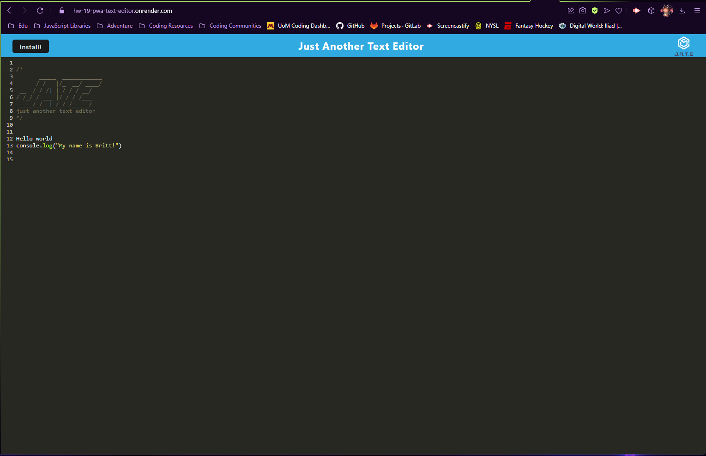
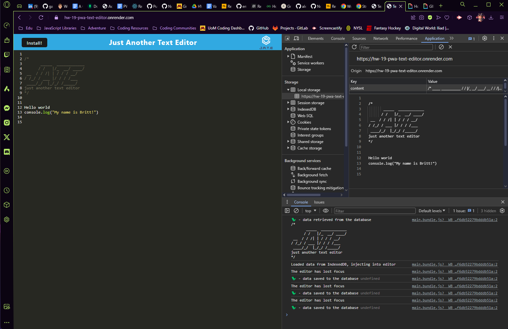

# 19 PWA Text Editor

## The Challenge: 
Your task is to build a text editor that runs in the browser. The app will be a single-page application that meets the PWA criteria. Additionally, it will feature a number of data persistence techniques that serve as redundancy in case one of the options is not supported by the browser. The application will also function offline.

To build this text editor, you will start with an existing application and implement methods for getting and storing data to an IndexedDB database. You will use a package called `idb`, which is a lightweight wrapper around the IndexedDB API. It features a number of methods that are useful for storing and retrieving data, and is used by companies like Google and Mozilla.

## Technology Stacks:
- Render

## npm Packages:
- Express.js

## Project Conduction:
As a developer, I want to create notes or code snippets with or without an internet connection, so that I can reliably retrieve them for later use while offline and on the go. 

## Acceptance Criteria
- When the user is given a text editor web application they can open the application in the editor, then they should see a client server folder structure.

- When the user runs `npm run start` from the root directory, they find that the application should start up the backend and serve the client.

- When the user run the text editor application from the terminal, the user finds that my JavaScript files have been bundled using webpack.

- When the user runs my webpack plugins, they find that the application has a generated HTML file, service worker, and a manifest file.

- When the user uses next-gen JavaScript in my application, they find that the text editor still functions in the browser without errors.

- When the user opens the text editor, they find that IndexedDB has immediately created a database storage.

- When the user enters content and subsequently click off of the DOM window, they find that the content in the text editor has been saved with IndexedDB.

- When the user reopens the text editor after closing it, they find that the content in the text editor has been retrieved from our IndexedDB.

- When the user clicks on the Install button, they download the web application as an icon on the desktop local computer.

- When the user loads my web application, they should have a registered service worker using workbox.

- When the user registers a service worker, they should have the static assets pre cached upon loading along with subsequent pages and static assets.

- When the user deploys to Render, they should have proper build scripts for a webpack application.

#### The Short List: 
 * Uses IndexedDB to create an object store and includes both GET and PUT methods

  * The application works without an internet connection

  * Automatically saves content inside the text editor when the DOM window is unfocused

  * Bundled with webpack

  * Create a service worker with workbox that Caches static assets

  * The application should use babel in order to use async / await

  * Application must have a generated `manifest.json` using the `WebpackPwaManifest` plug-in

  * Can be installed as a Progressive Web Application

## Mock-Up:
The following animation demonstrates the application:

View of the Home Page: 

Confirming Local Storage: 

## The Deployment:

The Repository: [Click Here.](https://github.com/NovaLanceBrittany/HW-19-PWA-Text-Editor)

The Render: [Click Here.](https://hw-19-pwa-text-editor.onrender.com)

